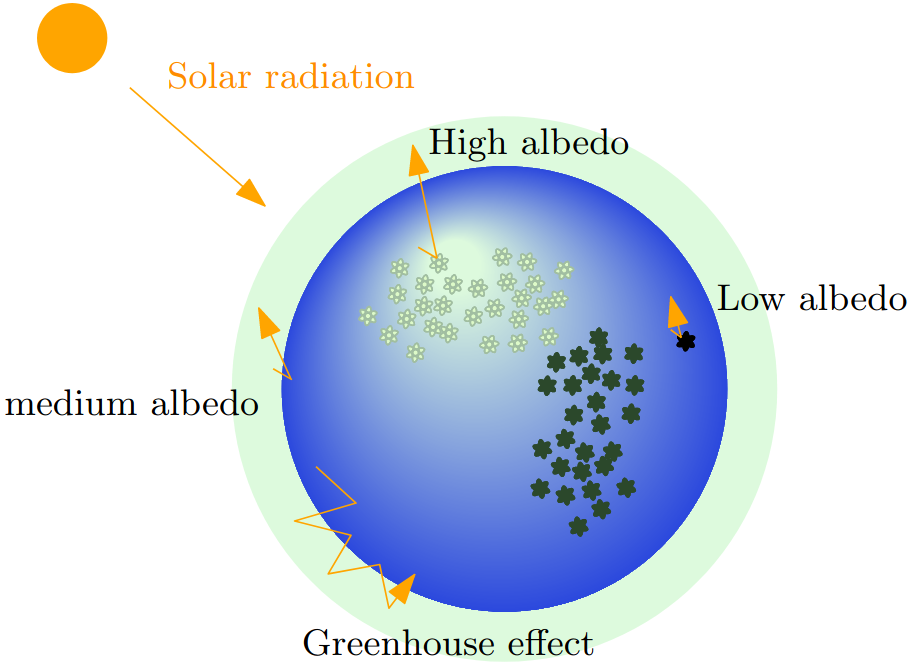

# DaisyWorld with greenhouse effect

Matlab implementation of Daisyworld with greenhouse effects

## Description
Daisyworld is a simplified model that describes the feedback mechanism between the life and environment of a planet. Daisyworld is a planet populated by two types of flowers: black daisies and white daisies (see Figure below). The colour of the daisies modifies the albedo of the planet and, therefore, its temperature. In return, the growth rate of the daisies is affected by the change in planetary temperature. The change in global temperature is also affected by the greenhouse effect, which can trigger a perturbation of the feedback mechanism. The present example shows how different parameters can affect the growth of the black and white daisies populating Daisyworld. Note that the greenhouse effect is not included in the original Daisyworld model, but it is relevant here to mimic a climate change event.

The sources of inspiration for this example are the study by [1] and the review paper by [2]. However, the implementation of the method is done from scratch. Therefore, the present implementation of Daisyworld may differ significantly from [1,2]. This is the first version of the submission. Some bugs may still be present. If you have any comments or question, please ask!

## Content
The repository contains:

- The function DaisWorld.m that runs the simulation case
- The function plotResults_daisyWorld.m that plots the results computed in the documentation
- The Matlab livescript Documentation.mlx that shows some examples

## References

[1] Susana LD Paiva, Marcelo A Savi, Flavio M Viola, and Albino JK Leiroz. Global warming description using daisyworld model with greenhouse gases. Biosystems, 125:1–15, 2014.

[2] Andrew J Wood, Graeme J Ackland, James G Dyke, Hywel TP Williams, and Timothy M Lenton. Daisyworld: a review. Reviews of Geophysics, 46(1), 2008.
